# 📚 LumoBook – Your Smart Book Shopping App

**LumoBook** is a **Flutter-powered book shopping app** built for readers who want to discover, bookmark, and purchase books — and **read them in PDF format right inside the app**. It uses **Firebase** for backend services and supports **Google and email authentication**.

---

## 🚀 Features

- 🔍 **Smart Search** – Quickly find books using keywords or titles.
- 📚 **Categories** – Browse books by curated genres and collections.
- 📖 **Book Previews** – Read descriptions before you buy.
- 📌 **Bookmarks** – Save your favorite books for later.
- 🛒 **Shopping Cart** – Add books and proceed to a secure checkout.
- 🔐 **Authentication** – Sign up or log in with **email/password** or **Google Sign-In**.
- 📄 **Read Purchased Books** – Access purchased books as PDFs inside the app.

---

## 🎨 UI/UX Design

- Crafted in **Figma** to ensure a modern, clean, and consistent UI.
- Prioritized **user experience**, accessibility, and readability.

---

## 🛠 Tech Stack

- **Flutter** – Cross-platform UI toolkit.
- **Firebase** – Authentication, Firestore, Cloud Storage.
- **Google Sign-In** – Easy and secure login.
- **Riverpod** – Scalable state management.
- **Figma** – UI prototyping and design.

---

## 📱 Screenshots

<p align="center">
   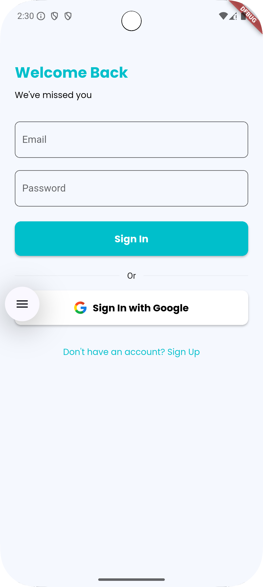
  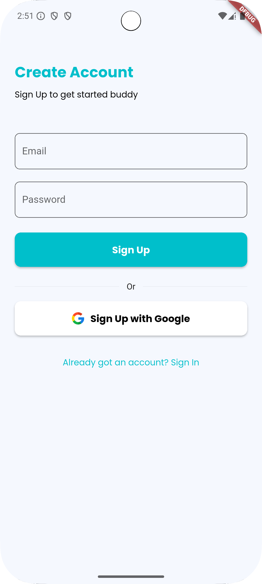
  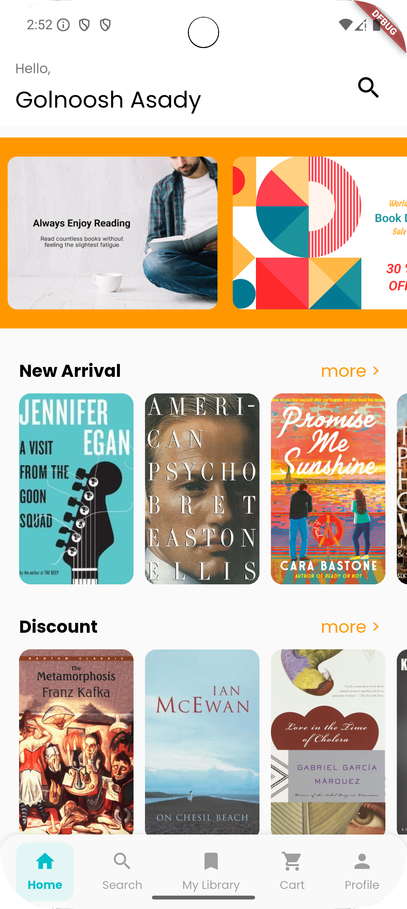
  
</p>

<p align="center">
   
  
    
      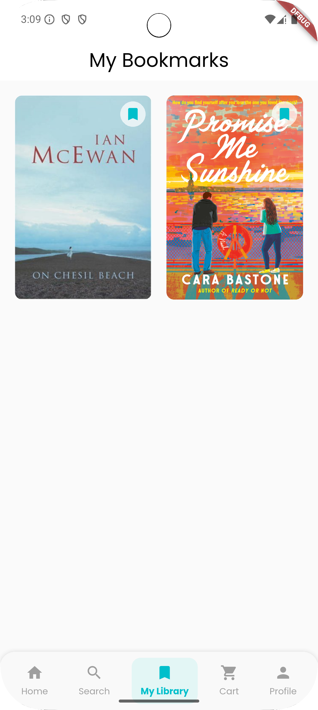

</p>
<p align="center">
  
  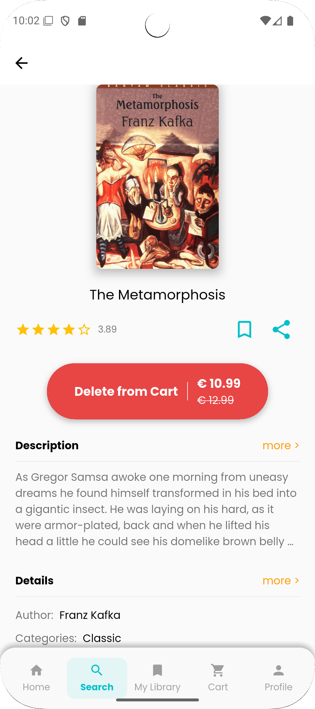
  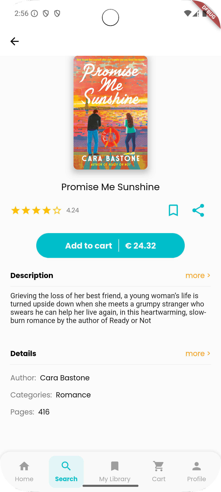

  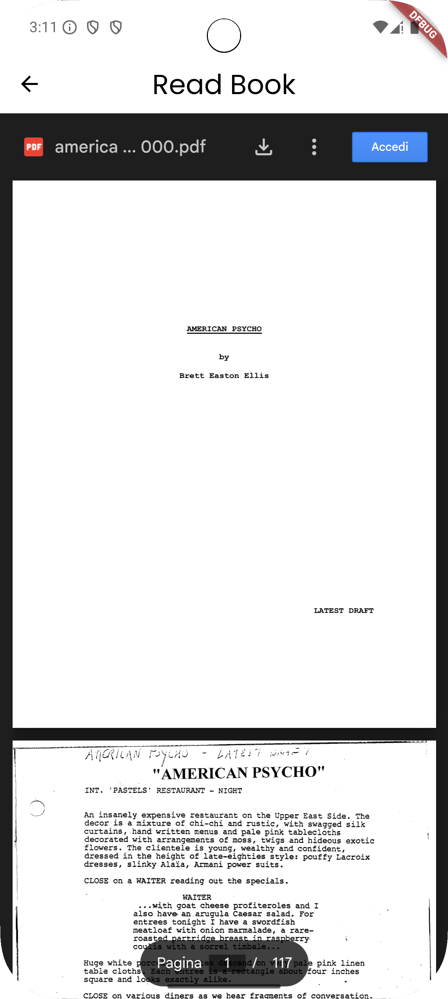

</p>

<p align="center">
    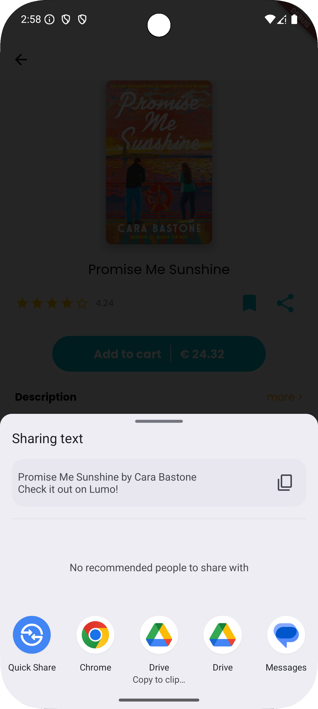
  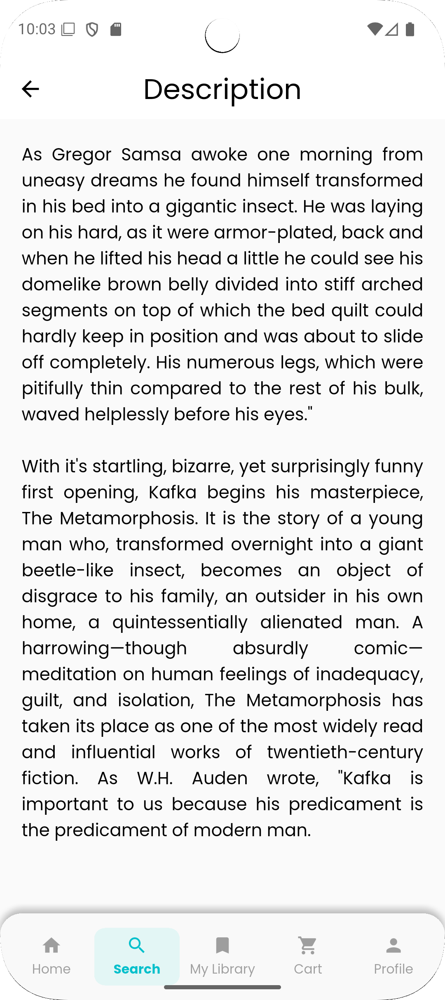
  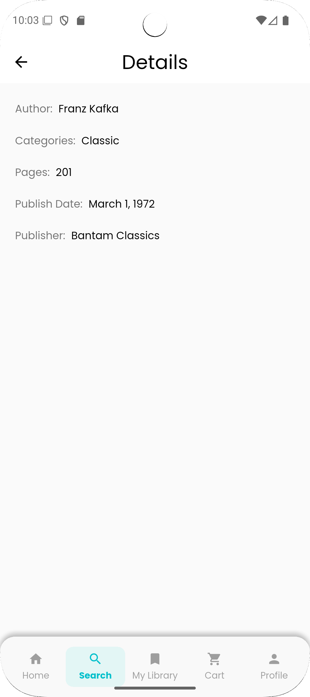
</p>

<p align="center">
  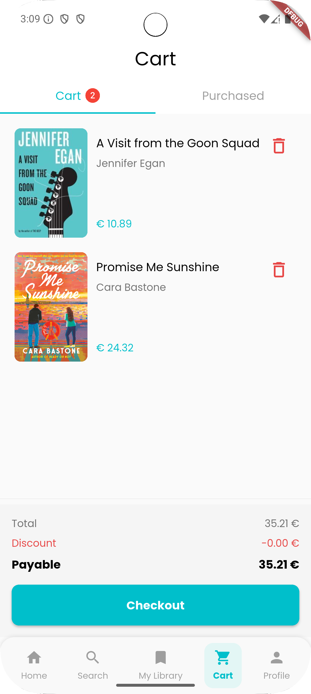
  
    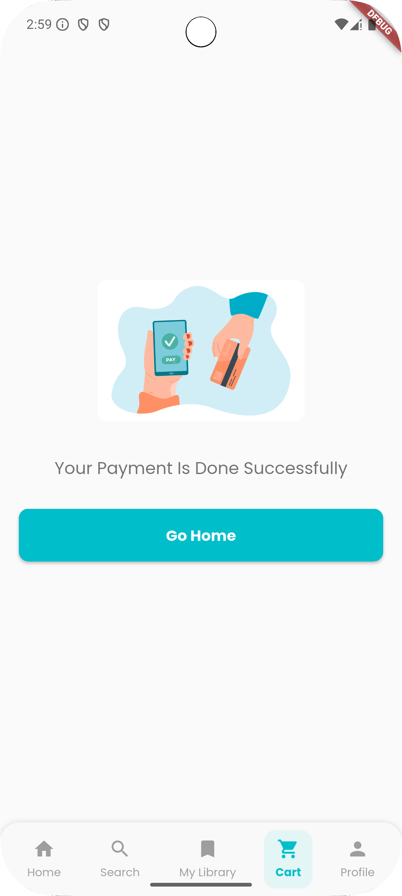

  
</p>

<p align="center">
  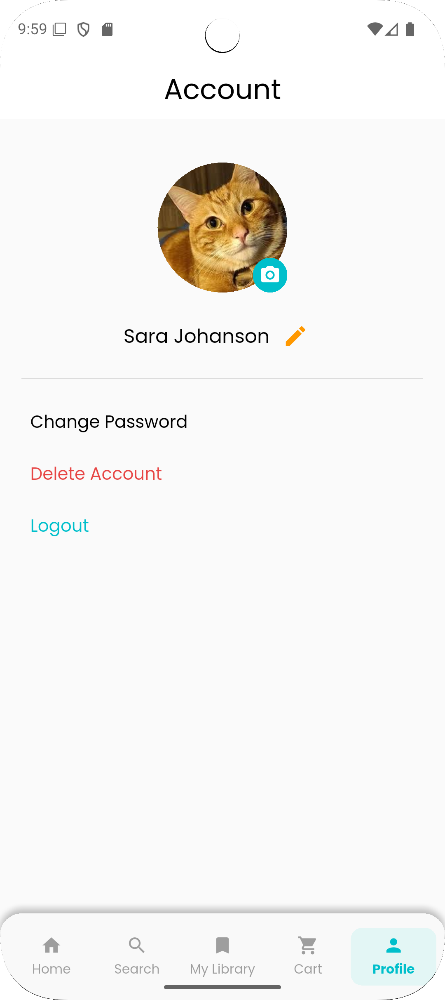
  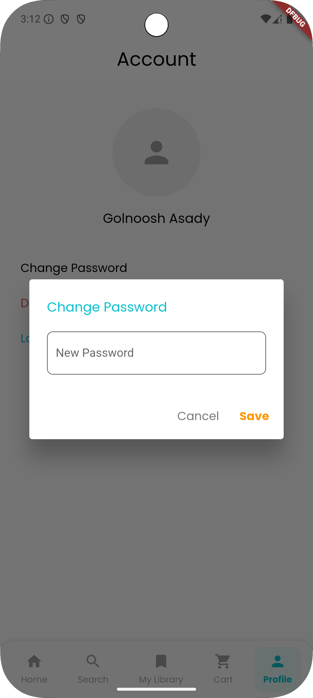
  
</p>

---

## 📥 Installation

1. Clone the repository:
   ```sh
   https://github.com/golnooshA/LumoBook.git
   ```
2. Navigate to the project directory:
   ```sh
   cd LumoBook
   ```
3. Install dependencies:
   ```sh
   flutter pub get
   ```
4. Run the application:
   ```sh
   flutter run
   ```

